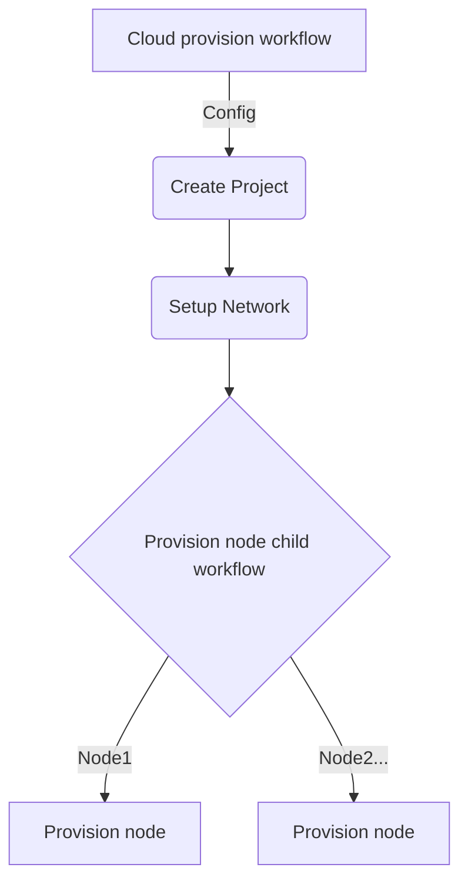

# temporal

Temporal demo

<!-- toc -->

* [Workflow](#workflow)
* [How to run](#how-to-run)
  * [DevContainers/VSCode](#devcontainersvscode)
* [Contributing](#contributing)
  * [Open in a container](#open-in-a-container)

<!-- Regenerate with "pre-commit run -a markdown-toc" -->

<!-- tocstop -->

## Workflow

This workflow simulates:
* the configuration of a new project within a cloud provider
* the creation of a network within the cloud project
* the creation of _n_ number of virtual machines in the cloud project

The project creation and network setup jobs run in the parent workflow as these
need running in a specific order and are likely to be fairly fast (<= 30 seconds).
The VMs are created by a child workflow to parallelise the jobs as these are
likely to be fairly slow (> 5 minutes).

No connections are made to any cloud account as this is just a simulation.

All cloud "connections" have a `simulateFailure` method which has a 1/10 (ish)
chance of failure to demonstrate the error handling workflow of Temporal.

## How to run

The Temporal UI server will be available on [localhost:8233](http://localhost:8233).

### DevContainers/VSCode

All dependencies are automatically installed if you [open in a container](#open-in-a-container).
A Temporal dev server will automatically run in a tab on startup. Alternatively,
run `make temporal-dev`

In two separate terminals, run:

* `make worker`
* `make starter`

## Contributing

### Open in a container

* [Open in a container](https://code.visualstudio.com/docs/devcontainers/containers)
